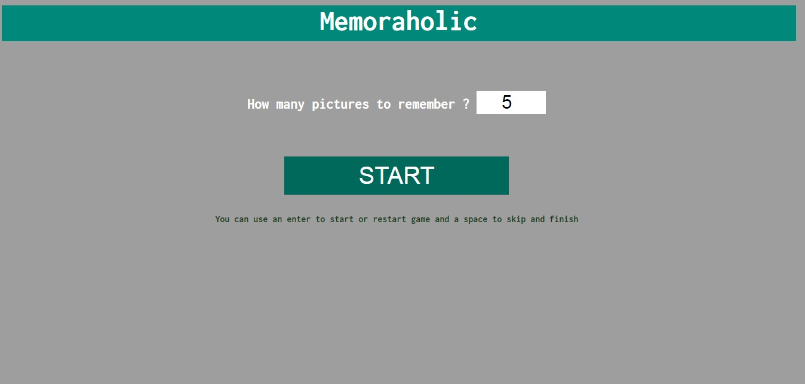

# Memoraholic
Train your memory by Memorize random images as accurately and quickly as possible.

50 second for memorization, 50 seconds for recall. 
If you memorize all the images in less than 50 seconds, you can stop the timer. 

-

-

